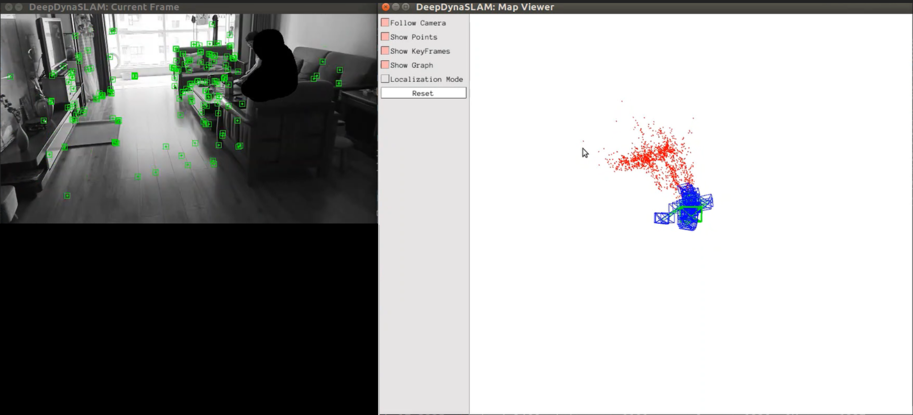
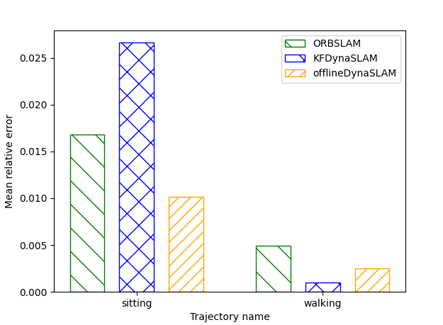
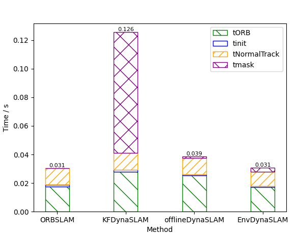

# KFDynaSLAM

KFDynaSLAM is a mono SLAM system that is designed to solve the problem of dynamic points culling in SLAM.
I use MaskRCNN to help cull the dynamic points and choose only KeyFrame to segment in order to speed up the system. The basic system is ORBSLAM.

So it's called **KFDynaSLAM**.

This is a part of the code of my undergraduate project in Shanghai Jiaotong University,"Improvement of Indoor Positioning Technology Based on SLAM--Research on the Problem of Dynamic Point Culling" . 

**The other part is dedicated to the using auxiliary information of the camera in the environment to help with dynamic point removal,called [EnvDynaSLAM]**. If there is any error, please pull issues or contact mingsjtu@163.com


KFDynaSLAM是一个为解决SLAM中的动态点去除问题而做的单目SLAM系统。我选用MaskRCNN以辅助动态点的去除，并通过只对关键帧进行语义分割以提升运行速度。

因此，我称他为**KFDynaSLAM**。

这是我在上海交通大学做的本科毕设项目《基于SLAM的室内定位技术改进--对环境中动态点去除问题的研究》的代码的一部分，另一部分致力于通过环境中摄像头的辅助信息进行动态点去除，EnvDynaSLAM。如有错误，欢迎 pull issues 或者联系mingsjtu@163.com


Below is a demo screen shot when the KFDynaSLAM is trying to processing a video taken in my house.

*Figure 1: Demo*




We provide examples to run the SLAM system in the [TUM dataset](http://projects.asl.ethz.ch/datasets/doku.php?id=kmavvisualinertialdatasets) as monocular, for the project is to research the SLAM use of indoor location. So I only use TUM dataset and my own video.


## Getting Started
1. Prepare ORB-SLAM
	- Install ORB-SLAM2 prerequisites: C++11 or C++0x Compiler, Pangolin, OpenCV and Eigen3  (https://github.com/raulmur/ORB_SLAM2).
2. Boost for python support
	- Install boost libraries with the command `sudo apt-get install libboost-all-dev`.
3. Prepare Mask RCNN
	- Install [detectron2](https://github.com/facebookresearch/detectron2). You can find install tutorial here https://github.com/facebookresearch/detectron2/blob/master/INSTALL.md.

	- To test whether you install successfully, you can try [step](src/python/step.py).(Remeber to varify the input and output path).
	- Make sure your system python is >=3.6, for only python>=3.6 can install PyTorch ≥ 1.4 and then detectron2
	- Download the `R50-FPN	3x` model from https://github.com/facebookresearch/detectron2/blob/master/MODEL_ZOO.md

Try
``` bash
python src/python/step.py

```

4. RUN
Clone this repo:
```bash
git clone https://github.com/mingsjtu/ORB-SLAM_MaskRCNN_KeyFrame.git
cd DynaSLAMORB-SLAM_MaskRCNN_KeyFrame
```
Change some path in [CMakeLists.txt](CMakeLists.txt) if needed
Build the project
```
cd ORB-SLAM_MaskRCNN_KeyFrame
chmod +x build.sh
./build.sh
```
Change path in [python_predictor](src/python/predictor.py) according to your own model path.
 

## Monocular Example on TUM Dataset
- Download a sequence from http://vision.in.tum.de/data/datasets/rgbd-dataset/download and uncompress it.

- Execute the following command. Change `TUMX.yaml` to TUM1.yaml,TUM2.yaml or TUM3.yaml for freiburg1, freiburg2 and freiburg3 sequences respectively. Change `PATH_TO_SEQUENCE_FOLDER` to the uncompressed sequence folder. Change `PATH_TO_MASKS` to your own mask path or the mask path you want the Segment module to save result in.

If `PATH_TO_MASKS` is provided, Mask R-CNN is used to segment the potential dynamic content of every frame. These masks are saved in the provided folder `PATH_TO_MASKS`. If this argument is `no_save`, the masks are used but not saved. If it finds the Mask R-CNN computed dynamic masks in `PATH_TO_MASKS`, it uses them but does not compute them again.

``` bash
./Examples/Monocular/mono_tum Vocabulary/ORBvoc.txt Examples/Monocular/TUMX.yaml PATH_TO_SEQUENCE_FOLDER PATH_TO_MASKS
```

# Test result
## Accuary
I use KFDynaSLAM and offlineSLAM(put done mask in `PATH_TO_MASKS` before run SLAM) and ORBSLAM using TUM dynamic dataset. The result is as below. 

*Figure 2: Max Error of diffrent methods*


*Figure 3: Min Error of diffrent methods*




It shows the KFDynaSLAM has better accuracy than ORBSLAM, and offlineSLAM is the best.

## Time
I use KFDynaSLAM and offlineSLAM(put done mask in `PATH_TO_MASKS` before run SLAM) and EnvDynaSLAM and ORBSLAM using TUM dynamic dataset. The result is as below.

*Figure 4: Time test result*




It shows the segment part is very time-costing.

You can find [EnvDynaSLAM]() here, which is another repository of mine. It can cull dynamic points with very short time.


## Acknowledgements
Thanks to [ORB-SLAM2](https://github.com/raulmur/ORB_SLAM2) and [DynaSLAM](https://bertabescos.github.io/DynaSLAM/)  that give a lot of help to my project.

